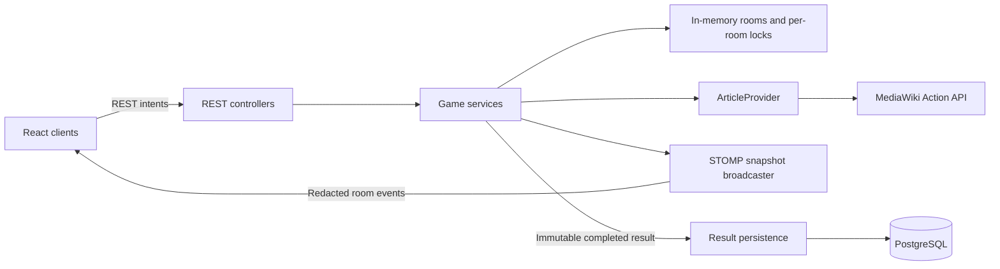
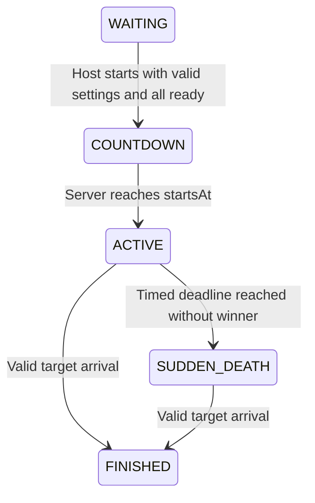

# WikiRace Architecture

Status: Phase 0 design. This document describes intended implementation, not existing functionality. PROJECT_SPEC.md remains authoritative; PHASE_PLAN.md controls when each component may be implemented. The repository currently contains documentation only.

## System Boundaries

One Java 21 / Spring Boot process owns all live rooms. React / TypeScript clients send commands through REST and later receive STOMP snapshots. English Wikipedia supplies article data through the official MediaWiki Action API. PostgreSQL stores completed results only, starting in Phase 7.



The backend owns room membership, host identity, settings, readiness, race status, countdown, timestamps, current article, clicks, history, history cursor, visit log, close status, winner, and finish time. Client state is a presentation cache. A client can submit an intent but cannot submit authoritative values for these fields.

## Backend Structure

Planned source root: `backend/src/main/java/com/wikirace/`. These are package responsibilities, not directories created by Phase 0.

| Package | Responsibility |
| --- | --- |
| config | Environment-driven configuration, CORS, scheduler and later WebSocket configuration |
| controller | HTTP binding, validation, token extraction, status codes; no gameplay rules |
| dto | Explicit request/response records and RoomSnapshotMapper; never serialize runtime objects |
| exception | Domain exceptions and centralized structured API errors |
| game/model | RaceRoom, PlayerRaceState, RaceSettings, RaceStatus, NavigationHistory, MoveAction, MoveType |
| game/service | RoomService for membership/settings; GameService for start/moves/transitions |
| game/runtime | RoomRegistry, per-room synchronization, scheduled transitions and cleanup |
| wikipedia | ArticleProvider, FakeArticleProvider, later WikipediaArticleProvider, HTTP parsing, sanitization and caching |
| websocket | Authenticated STOMP sessions, subscriptions, connection tracking and room event publishing |
| persistence | Completed result entities, repositories, mapping and transactional save |
| common | Small shared values such as injected Clock and secure token/code generation helpers where needed |

Use concrete classes by default. ArticleProvider is the intentional interface: the game engine needs a deterministic fake graph in Phase 2 and a real provider in Phase 3. Its conceptual operations are search(query), resolve(title), and loadArticle(canonicalTitle). ArticleData contains canonical title, page/revision identifiers where available, sanitized HTML, and immutable canonical outgoing links. No HTTP types cross into game services.

RoomRegistry uses a concurrent map keyed by unique room code. Register codes atomically with collision retry using `ABCDEFGHJKLMNPQRSTUVWXYZ23456789`. Each room has its own ReentrantLock. There is no global gameplay lock, distributed lock, Redis, or microservice boundary.

## Runtime Domain Model

| Model | Fields and invariants |
| --- | --- |
| RaceRoom | UUID id, code, hostPlayerId, ordered players, settings, status, version, createdAt, lastActivityAt, startsAt, suddenDeathStartedAt, finishedAt, winnerPlayerId, result persistence status; lock is internal only |
| PlayerRaceState | UUID playerId, displayName, token digest, ready, connected session count, disconnectedAt, currentArticle, clickCount, NavigationHistory, visitLog, movementRevision, bounded recent action records |
| RaceSettings | Canonical startArticle and targetArticle, unlimited, nullable timeLimitSeconds; initially unconfigured; valid for start only when both articles exist, differ, and timed duration is at least 180 seconds |
| RaceStatus | WAITING, COUNTDOWN, ACTIVE, SUDDEN_DEATH, FINISHED |
| NavigationHistory | Ordered canonical entries and zero-based cursor; currentArticle equals entries[cursor] during gameplay |
| MoveAction | UUID actionId, MoveType, destinationArticle only for NAVIGATE; BACK has no destination |
| MoveType | NAVIGATE or BACK |

Display names contain 2-20 Unicode code points, using letters, numbers, spaces, periods, underscores, apostrophes and hyphens. Reject unsupported symbols and emoji. Count code points rather than UTF-16 units. Names are display text, never identifiers or HTML.

Room creation installs one host; joining requires WAITING and fewer than four players. Start requires 2-4 players, every player explicitly ready including host, and valid settings. Only the host changes settings or starts. Any actual gameplay setting change during WAITING resets every ready flag. A repeated identical settings request is a no-op. Ready sets an explicit boolean rather than blindly toggling, so retries are safe.

On race start initialize every player's history and visit log to the starting article, cursor and clicks to zero, and compute close status from its outgoing links. Article state is withheld during COUNTDOWN to avoid exposing a playable page before GO. Navigation and BACK are accepted only in ACTIVE or SUDDEN_DEATH.

Successful NAVIGATE requires destination in outgoingLinks(serverKnownCurrentArticle). Truncate any forward branch, append destination, move cursor, increment clicks once and append destination to visitLog. Successful BACK decrements cursor, increments clicks once and appends the resulting article to visitLog. At cursor zero reject BACK without a gameplay mutation. There is no forward command.

Example: A -> B -> C -> BACK -> D leaves history [A, B, D], cursor 2, visit log [A, B, C, B, D], and four clicks. During gameplay, visitLog.size = clickCount + 1. Failed actions and retained duplicate IDs do not increment clicks or append visits.

closeToTarget is true exactly when targetArticle belongs to the current article's canonical outgoing set. Recompute on each successful movement, including BACK. Do not explicitly tell the player they are close. Opponents receive the warning with currentArticle null and no history, visit log, article HTML, or equivalent revealing metadata. At FINISHED all player paths become visible in results.

## Race Lifecycle and Timing



Server sets startsAt = acceptedStartTime + 3 seconds. startsAt remains the authoritative race origin even if a scheduled callback runs late. For timed races the deadline is startsAt + timeLimitSeconds. suddenDeathStartedAt is that deadline, not callback execution time. Unlimited races never enter sudden death. Winning sets winnerPlayerId and finishedAt atomically and permanently; no movement is committed afterward.

Clients display countdown and timers from timestamps plus serverTime for approximate clock offset. Normal timed display counts down; unlimited counts up; sudden death counts up from the deadline. Finish freezes display at finishedAt. Client timer expiration cannot mutate status or decide a winner.

An injected Clock enables deterministic tests. A scheduler invokes transitions under the room lock. Command handling also checks overdue transitions before applying mutations, preventing scheduler delay from admitting pre-start moves or skipping sudden death. Each distinct authoritative mutation increments version once; a no-op/rejection does not, except an independently due time transition. Several overdue transitions produce separately versioned snapshots.

## Concurrency and Movement Commit

1. Authenticate token and capture the player's current article, movementRevision, relevant settings and race status under the room lock. Check retained action IDs before rate limiting or external calls.
2. Release the lock. Resolve the proposed destination and fetch the source and resulting article data through ArticleProvider. BACK captures its previous entry under lock and loads that article outside the lock. A start command similarly prepares the starting article and close state outside the lock.
3. Reacquire the lock. Reauthenticate membership, advance due time transitions, recheck actionId, status, settings and player movementRevision. If that player's state changed while fetching, reject with STATE_CHANGED so the client can refresh; do not silently apply an intent against a different source. Other players moving does not invalidate this player's movement.
4. Validate the canonical edge or history operation using prepared data. Commit current article, history, visit log, clicks, close state and winner together. Store the accepted action record and freeze the response/event snapshot inside the lock.
5. Release the lock before broadcasting or persistence. Never pass mutable room/player objects to async work.

The first target arrival to commit under the room lock wins, not the earliest browser click or upstream request completion. Competing arrivals then see FINISHED. Overlapping copies of an action may perform redundant reads but only one commits. Upstream failure commits no movement. Settings/start preparation must recheck captured settings and all readiness before commit.

Phase 2 implements an insertion-ordered bounded cache per player containing the most recent 2,048 ACCEPTED movement action records. Capacity is configurable, with 2048 as the default. Each record contains actionId, intent fingerprint and accepted room/version metadata needed for duplicate handling. Entries remain until capacity eviction (oldest accepted record first) or room cleanup; duplicate lookup does not reorder entries and there is no time-based expiration.

Matching retained actionId with the same intent returns DUPLICATE with fresh authoritative state, without applying movement again. Matching retained actionId with a different intent returns ACTION_ID_CONFLICT. Check the record before rejecting FINISHED so retrying a retained winning action is safe. Failed, rejected and transient-upstream actions are not stored as successful action records; retrying the same intent after a transient upstream failure is allowed.

Duplicate suppression is guaranteed only while actionId remains retained. There is no infinite replay protection after eviction. An evicted old request is treated as a new request and must pass all current server-authoritative state and navigation validation before any movement can be committed.

Publish immutable events outside the lock. Events may arrive out of order; clients reject versions no newer than the last accepted version. Preserve all required lifecycle events when one command advances multiple states. FINISHED handling must still complete locally if broadcasting or database saving fails.

## API and Privacy

The conceptual contracts are in [api.md](api.md). REST is the sole mutation path; WebSocket carries server snapshots. Reject client-supplied authoritative fields and unexpected movement fields. Tokens belong only in authenticated headers or the private create/join response. Never log or broadcast them.

Shared RoomSnapshot contains redacted players. RoomView separately contains only the requesting player's private current article, click count, back availability and movementRevision, without a close boolean. The private article endpoint authorizes the requesting token and loads only their server-known article. Recheck movementRevision after loading to avoid returning content for an obsolete location.

Shared events include neither private player state nor opponent paths. Private REST responses use Cache-Control: no-store. Result paths become available only when FINISHED.

## WebSocket Design

Planned endpoint `/ws`, native WebSocket with Spring STOMP, and subscription `/topic/rooms/{code}`. The CONNECT frame carries roomCode and X-Player-Token as STOMP headers, not URL parameters. Validate token membership on CONNECT and bind a server-created principal to that room/player. On SUBSCRIBE recheck membership and allow only that exact room destination; reject wildcards, other rooms and all client SEND commands. Restrict handshake origins through configuration.

RoomEvent fields: type, roomCode, version, occurredAt, room (redacted RoomSnapshot). Events: ROOM_UPDATED, PLAYER_JOINED, PLAYER_READY_CHANGED, SETTINGS_UPDATED, COUNTDOWN_STARTED, RACE_STARTED, PLAYER_MOVED, PLAYER_CLOSE_CHANGED, PLAYER_DISCONNECTED, PLAYER_RECONNECTED, SUDDEN_DEATH_STARTED, RACE_FINISHED. PLAYER_CLOSE_CHANGED can be the movement event when close status changes; otherwise use PLAYER_MOVED. Every event carries a complete snapshot and a unique mutation version.

Count active STOMP sessions per player. Multiple tabs do not create duplicate players. Disconnect marks disconnected only after the final session closes; reconnect restores the existing player. Configure heartbeats to detect dropped connections. Connection changes mutate version and broadcast status without changing race progression.

On refresh, read roomCode and playerSessionToken from localStorage, connect and subscribe, buffer events, then fetch GET room state and private article data. Apply the REST snapshot and only newer buffered snapshots; repeat private article fetch when needed. This order prevents missing a mutation between snapshot fetch and subscription. Retry connection with capped exponential backoff and jitter. On reconnect fetch authoritative state again; never replay gameplay automatically with a new actionId.

## Sessions and Cleanup

Issue a secure opaque 256-bit token with SecureRandom at create/join. Store a SHA-256 digest in live state, compare safely, and scope authentication to the room. No accounts, passwords or OAuth. REST uses X-Player-Token. localStorage stores only roomCode and playerSessionToken; gameplay and time are not restored from localStorage. There is no token recovery after loss or backend restart.

During WAITING retain disconnected slots for approximately five minutes. Give newly joined players the same connection grace window. Cleanup removes an expired non-host slot under lock and broadcasts the changed membership. If the host never returns after grace, expire the abandoned lobby rather than silently introducing host migration. COUNTDOWN, ACTIVE and SUDDEN_DEATH retain players; a disconnect never cancels a race. Disconnected players can return to the same state until the room is cleaned.

Phase 6 adds scheduled stale WAITING and old FINISHED room removal and per-player movement rate limiting around 5-10 requests/second. It may harden/configure the bounded recent-action mechanism introduced in Phase 2. Cleanup removes rooms atomically and closes room subscriptions. Never expire a live race merely because a player disconnects. Since unlimited/sudden-death races can remain live indefinitely, abandoned active rooms are an acknowledged resource limitation; changing that gameplay policy requires explicit approval. Cleanup timing and cache limits are environment-configurable and documented in their implementation phases.

## Wikipedia Integration

Use HTTPS to fixed host `en.wikipedia.org`, path `/w/api.php`; URL-encode parameters and never fetch a client-provided URL. Choose the official Action API mechanisms below, verified against the linked primary documentation.

| Operation | Mechanism |
| --- | --- |
| Autocomplete | action=query, list=prefixsearch, pssearch=query, psnamespace=0, pslimit=10; title-only suggestions are sufficient |
| Lookup and redirects | action=query, titles=title, redirects=1, prop=info, format=json, formatversion=2; consume normalized/redirect mappings and reject missing/invalid pages |
| Content and outgoing links | action=parse, pageid=resolvedPageId, prop=text\|links\|revid, format=json, formatversion=2; obtain content and links together |

Prefix search and title/redirect resolution are documented in [API:Prefixsearch](https://www.mediawiki.org/wiki/API:Prefixsearch) and [API:Query](https://www.mediawiki.org/wiki/API:Query). Parsed HTML, internal links and revision selection are documented in [API:Parsing wikitext](https://www.mediawiki.org/wiki/API:Parsing_wikitext).

Treat returned canonical title as authoritative; do not invent title casing. Resolve redirects in bounded batches for outgoing targets, keep only existing final namespace-0 articles, and maintain alias-to-canonical mapping within ArticleData. Reject forbidden namespaces by API namespace IDs, not colon alone (some main-namespace titles contain colons). Reject external/interwiki URLs and non-main namespace redirect destinations. Disambiguation pages remain allowed. Strip fragments from article destinations; same-page section anchors stay local and are not movement commands.

Canonical outgoing links determine both valid moves and close detection. Rewrite eligible article anchors using that same canonical map. If required link/canonicalization data cannot be completed, fail the article load rather than silently serving a partial allowed-link set. Cache HTML and outgoing links as one immutable article snapshot so they cannot refer to separate fetches. Wikipedia is mutable; cached snapshots provide consistency, not permanent revision freezing for an entire race.

Use Jsoup allowlist sanitization. Keep title separately and basic paragraphs, headings, lists, emphasis, readable tables and safe anchors. Remove script/style/form/input/iframe/object/embed elements, event handlers, inline styles, upstream classes and unsafe attributes/URLs. Replace eligible anchors with `href="#"` and application-generated `data-wiki-title` containing the canonical destination. Neutralize external and forbidden links to readable text. Allow safe same-document section anchors after normalizing IDs. Images are optional and omitted initially. Frontend HTML sanitization is defense in depth; all moves still require independent backend validation.

Caffeine defaults: maximum 500 article entries, 30-minute expiry; keep aliases bounded as well. Configuration can adjust these values. Coalesce concurrent identical loads where practical. Never use unbounded caches or cache failure as a playable empty article. Keep a snapshot reference for each player's current location so close status and valid edges do not drift while they remain on that article; replacing it happens on movement.

Configure a 3-second connection timeout and 10-second overall article-load budget, including batched resolution, with bounded response size. Use an identifiable WikiRace User-Agent with a real project contact configured when integration is implemented. Timeouts, upstream 429/5xx, API error bodies, malformed JSON and incomplete results become structured WIKIPEDIA_UNAVAILABLE responses. Missing articles become ARTICLE_NOT_FOUND. No slow network I/O under a room lock, no endless retries and no committed half-move. Tests use the fake provider or a mocked HTTP boundary, never live Wikipedia.

## Frontend Structure and UI

Planned `frontend/src/` structure:

| Directory | Responsibility |
| --- | --- |
| api | Typed REST client, token headers and error parsing |
| components/environment | RoomBackground, DeskScene, DeskLamp, CoffeeCup, Notebook |
| components/laptop | Laptop shell and LaptopDisplay |
| components/lobby | Players, settings, autocomplete and readiness controls |
| components/race | HUD, article reader, Back, players, close warning and countdown |
| components/results | Winner, timing, settings summary and ordered player paths |
| hooks | Room lifecycle, article loading, timestamp display and restrained sounds |
| pages | LandingScreen and room route choosing lobby/countdown/race/results by server status |
| realtime | STOMP connection, authorized subscription, backoff and snapshot version ordering |
| state | React context/reducer for authoritative snapshot cache and private player view |
| styles | CSS Modules and shared design tokens |
| types | Contract types matching api.md |
| utils | Pure timer formatting, input normalization and UUID intent creation |

React Router supports `/` and `/room/:code`. A share URL contains a room code, never a token. A visitor without a token enters a display name and joins; a returning token fetches existing identity. Use normal state/context/hooks, not an additional global state library. Local state owns inputs, loading/errors, mute and visual effects only. Pending moves generate one UUID and preserve that UUID for retries; prevent duplicate click submission and update the article only after server confirmation.

```text
GameEnvironment
  RoomBackground
  DeskScene
    DeskLamp
    CoffeeCup
    Notebook
    Laptop
      LaptopDisplay
        Landing / Lobby / Countdown / Race / Results / Error states
```

The screen is the functional application inside a generic unbranded laptop. Desktop uses a cozy dark university room, warm lamp, desk texture, keyboard, notebook, coffee and restrained screen glow. Laptop takes roughly 80-85% of usable width; article content scrolls inside its screen. Tablet reduces decoration while retaining laptop identity. Mobile hides most scenery and prioritizes a viewport-filling game screen with reachable controls and readable text.

Use HTML/CSS perspective, transforms and shadows, with no Three.js/WebGL. Optional 2-4px parallax must be disabled for reduced motion. Keep the article readable, with target/timer/clicks/Back in HUD and opponent statuses beside it. CLOSE warnings use red plus text/icon and must never display the hidden article. The player's own article is visible without a special self-close notification. Countdown, GO, opponent-close, win and lose sounds are restrained, muted through a visible control, and have no background music. Keyboard controls, labels, focus, contrast and reduced motion are required.

In Phase 4 REST reads support the developing flow without a replacement polling framework. Minimum two-player start rules remain in force: acceptance verification needs a second test participant even when reviewing the primary browser's flow. Phase 5 supplies real-time synchronization; Phase 6 improves native browser Back carefully while retaining in-game Back as canonical.

## Completed-Race Persistence

Live room state stays in memory; a server restart loses active rooms and guest tokens. MVP assumes one backend instance. In Phase 7 add Spring Data JPA, PostgreSQL and Flyway, with explicit versioned migrations and production schema validation rather than auto-create.

Choose normalized rows: completed_race (UUID id equal to runtime room id, roomCode, startArticle, targetArticle, unlimited, nullable timeLimitSeconds, startedAt, suddenDeathStartedAt, finishedAt, winnerPlayerId); player_result (raceId, playerId, displayName, clickCount, finalArticle, winner flag); visit_step (raceId, playerId, stepIndex, articleTitle). Composite uniqueness on race/player and race/player/step preserves identity and path ordering. Use foreign keys; fetch steps ordered by stepIndex. Timestamps are UTC and represent server decisions. No session tokens, locks or WebSocket state are persisted.

Capture an immutable completed result under the room lock at the winner commit. Save the race, players and ordered steps in one database transaction outside that lock. Unique race ID makes repeated persistence attempts safe. Track availability separately from race status: PENDING, SAVED or FAILED. Failure logs safely, leaves winner/FINISHED untouched and keeps runtime results available until normal room cleanup. No durable retry queue is implied; a failed save followed by restart may lose that completed result. GET race results succeeds for retained live finished rooms or persisted records and therefore survives restart only after a successful save.

## Verification Strategy

Phase 0 checks are document coverage, contract consistency, relative links, code fence balance, unchanged control-file hashes and absence of application code/dependencies. There is no backend or frontend build to run yet. Later phases add JUnit/Spring tests for invariants and concurrent winners, mocked Wikimedia parsing/sanitization tests, meaningful Vitest/component tests, four-browser real-time checks, and PostgreSQL integration tests in the phases that introduce those systems.

## Known Design Limits

- Idempotency is bounded to the retained action window: the most recent 2,048 accepted movement records per player by default, configurable. Evicted IDs receive no duplicate-suppression guarantee and are treated as new requests subject to all current server-authoritative state and navigation validation.
- Live rooms do not survive restart and cannot be shared across backend instances.
- Unlimited active races have no abandonment timeout in the product rules.
- Successful database saves survive restart; failed saves do not have a durable retry mechanism.
- Provider fixtures and integration tests must verify actual upstream shapes in Phase 3; no upstream functionality exists in Phase 0.
